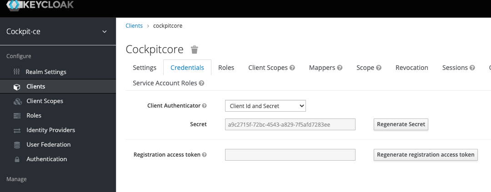
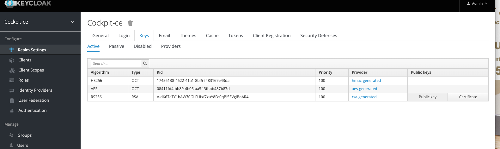
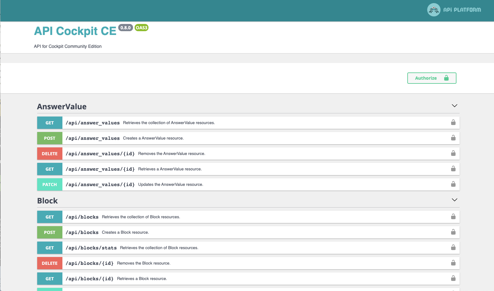
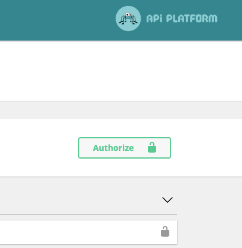
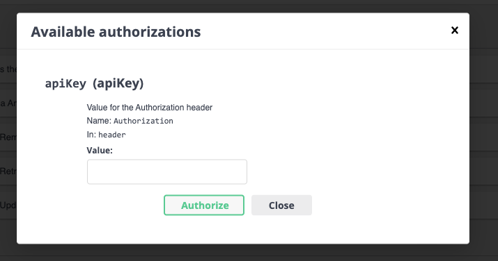
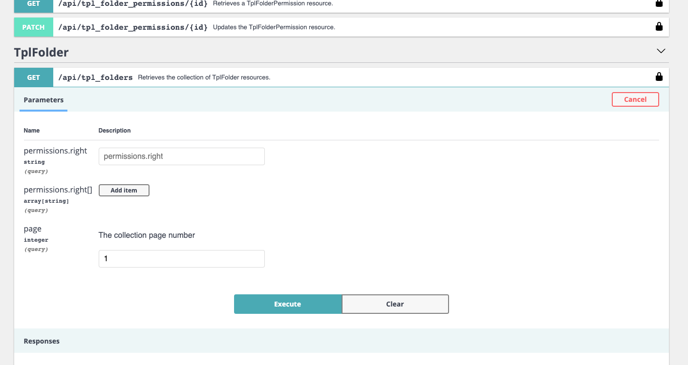

# Cockpit Community Edition - Core API

This is the API for Cockpit CE based on [Symfony 5](https://symfony.com/) core, with [API Platform](https://api-platform.com/) bundle.

## Prerequisites

Just check [README](../README.md)

## Configuration

All environment variables are set in [.env](../.env) file in `Core` directory :


### Keycloak
| key         | value                  |
| :---------- | :--------------------- |
| `DATABASE_URL`| the database URL  ([doctrine format](https://www.doctrine-project.org/projects/doctrine-dbal/en/2.10/reference/configuration.html#connecting-using-a-url)) |
| `KEYCLOAKURL`| the keycloak URL. ie `https://keycloak.cockpitlabs.io`. It's often use with port 8080 ([check docker keycloak documentation](https://hub.docker.com/r/jboss/keycloak/)) 
| `KEYCLOAKAUTHURL`| the keycloak authentication URL. ie `https://keycloak.cockpitlabs.io/auth`
| `KEYCLOAKSECRET`| the file containing the cockpitcore client secret in Keycloak 

### Core
| key         | value                  |
| :---------- | :--------------------- |
| `APISERVER`| the host name where `Core` is installed 
| GOTENBERGURL |  http://localhost:3000
| `JWT_PASSPHRASEFILE`| file containing the cockpitcore client secret
| `JWT_SECRET_KEY`and `JWT_PUBLIC_KEY`| file containing keys found in Keycloak realm. This is `public key`and `certificate` buttons on the right. 

In the default `.env`file, key files are located in `Core` directory. This is not secure. In production, move them in safe places.

## Load tests data

To initialize data, you need run some console command:

### initialize Keycloak data

Asserting your apache user is `www-data`, you must run command with this user (because of log creation, files permissions, and so).

For injecting `keycloak` datas, use :

` sudo -u www-data bin/console demo:load --keycloak demo/keycloak.json --kcadmin <keycloak admin user> --kcadminpwd '<keycloak admon password>'`

To restore Keycloak keys, use :

` sudo -u www-data bin/console demo:load --kcrebuild --kcadmin <keycloak admin user> --kcadminpwd '<pwd>'`

This command will get public key, private key (certificat) and cockpitcore secret from Keycloak and copy them to files (define in `.env`).

### initialize Cockpit  data

For injecting `templates`, use :

` sudo -u www-data bin/console demo:load --template demo/TemplatesRetail.json --clean`


To reset DB and rebuild, use :

` sudo -u www-data bin/console demo:load --rebuild`

To clean DB (empty DB tables), use :

` sudo -u www-data bin/console demo:load --clean`

To generate fake data (filled folders), use :

` sudo -u www-data bin/console demo:load --fakedata`


## Test `Core` with local Symfony webserver

### local Weberver Installation

First, install `symfony binary` in `Core` directory: 
```bash
curl -sS https://get.symfony.com/cli/installer | bash
```

Then, run webserver:

```bash
sudo -u www-data symfony server:start --no-tls
```

You can find the API `Core` url in terminal:

```shell script
~/CockpitCE/Core » symfony server:start --no-tls
Sep  1 16:48:20 |DEBUG| PHP    Reloading PHP versions
Sep  1 16:48:20 |DEBUG| PHP    Using PHP version 7.2.32 (from default version in $PATH)
Sep  1 16:48:20 |INFO | PHP    listening path="/usr/local/Cellar/php@7.2/7.2.32/sbin/php-fpm" php="7.2.32" port=57340
Sep  1 16:48:20 |DEBUG| PHP    started
Sep  1 16:48:20 |INFO | PHP    'user' directive is ignored when FPM is not running as root
Sep  1 16:48:20 |INFO | PHP    'group' directive is ignored when FPM is not running as root
Sep  1 16:48:20 |INFO | PHP    fpm is running, pid 34360
Sep  1 16:48:20 |INFO | PHP    ready to handle connections

 [OK] Web server listening on http://127.0.0.1:8000 (PHP FPM 7.2.32)
```

### Authentication

Open `API Cockpit CE` at `http://127.0.0.1:8000/api` :



You need a token to use test endpoints on the API page.

To get one, do (in `Core` directory):

````shell script
~/CockpitCE/Core » bin/console demo:token:generate --username audie.fritsch --client cockpitview
Demo token generator
=================

Generating token for user audie.fritsch and client cockpitview
--------------------------------------------------------------

Bearer eyJhbGciOiJSUzI1NiIsInR5cCIgOiAiSldUIiwia2lkIiA6ICJBLWRLNjdhVFkxYkFXNzBHTEZVZnhmN3h1WThGZTBxQmw1RVZnbEJvQVI0In0
.eyJleHAiOjE1OTg5NzI2NzUsImlhdCI6MTU5ODk3MjM3NSwianRpIjoiZjZhM2E2ZGItMmZkMy00Zjg4LTg2OGMtZjBiOWFmZGMyNDFiIiwiaXNzIjoiaHR0cHM6L
y9rZXljbG9hay52YWdyYW50LmNvY2twaXRsYWIubG9jYWwvYXV0aC9yZWFsbXMvY29ja3BpdC1jZSIsInN1YiI6ImFjMjQ2MmFkLWZiNGYtNDNkMS1hZjYzLWI2OWU
zMWVkNTczZiIsInR5cCI6IkJlYXJlciIsImF6cCI6ImNvY2twaXR2aWV3Iiwic2Vzc2lvbl9zdGF0ZSI6IjVlMmM5MTI0LTIzYjUtNDRkZi1hMGNjLTA3YmFjZmM0N
TAxYyIsImFjciI6IjEiLCJhbGxvd2VkLW9yaWdpbnMiOlsiKiJdLCJyZWFsbV9hY2Nlc3MiOnsicm9sZXMiOlsiQ0NFVXNlciIsIkNDRUFkbWluIiwiQ0NFQ291bnR
yeU1hbmFnZXIiLCJDQ0VEYXNoYm9hcmQiXX0sInNjb3BlIjoicHJvZmlsZSBlbWFpbCIsImVtYWlsX3ZlcmlmaWVkIjpmYWxzZSwibmFtZSI6IkF1ZGllIEZyaXRzY
2giLCJwcmVmZXJyZWRfdXNlcm5hbWUiOiJhdWRpZS5mcml0c2NoIiwiZ2l2ZW5fbmFtZSI6IkF1ZGllIiwiZmFtaWx5X25hbWUiOiJGcml0c2NoIiwiZW1haWwiOiJ
hdWRpZS5mcml0c2NoQGNvY2twaXRsYWIuaW8ifQ.B_yunjlhqcw6fBSOQxUS-5Klv6nEqlfwsfMA6H2Pus2GAmbmtmIIs5hFKBMlhgcD8iSBV18wPV9UNjh
-JabEFyLxJbCuRCLQWlrpb4jnx0iwKV1wO6lnAsBYTpEGpqf0IAK4JsuARurwokHPGVgD__Xz4CTRnzif6CgTz49QUIISHtazPYfqr6vlYtZWAeZwqhzfwvyRPVejY
iXxtRqFS90zs3iNBfYWcvSH8YkoSz539jH_eeYkrLkuWmYp3_Jj0CK4JsSZl0SQTIf1oBBgYP4Vg8_TgNndrOM1sZO3e3ZL32T8ZMm88vEUsU6RRq4Bmz1LAZvXtnN
XsTOxl8rjIA

```` 

Then, copy the token, including the word `Bearer`. In the API page, click on the padlock 



Then, paste you token in the edit apiKey field:



Now, you can test API.


